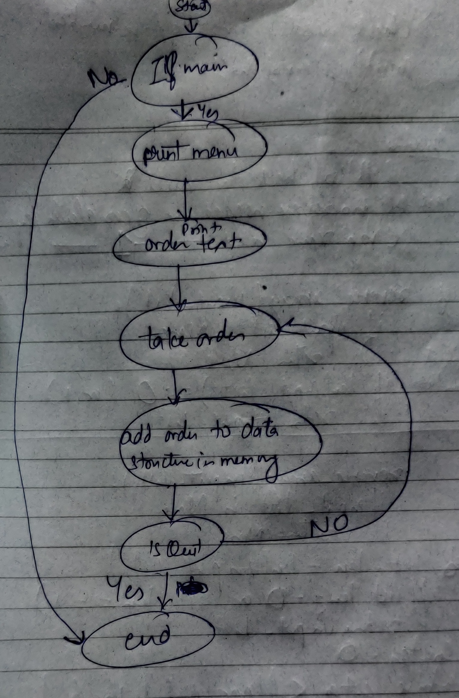

# Snakes Cafe

## Challenge
Mimic a point of sales machine for a restaurant, Snakes Cafe.
The program should work like 

    $ python snakes_cafe.py
    **************************************
    **    Welcome to the Snakes Cafe!   **
    **    Please see our menu below.    **
    **
    ** To quit at any time, type "quit" **
    **************************************
    
    Appetizers
    ----------
    Wings
    Cookies
    Spring Rolls
    
    Entrees
    -------
    Salmon
    Steak
    Meat Tornado
    A Literal Garden
    
    Desserts
    --------
    Ice Cream
    Cake
    Pie
    
    Drinks
    ------
    Coffee
    Tea
    Unicorn Tears
    
    ***********************************
    ** What would you like to order? **
    ***********************************
    >
    Entering an order
    ***********************************
    ** What would you like to order? **
    ***********************************
    > Wings
    
    ** 1 order of Wings have been added to your meal **
    
    > Wings
    
    ** 2 orders of Wings have been added to your meal **
    
    > quit
    
    $>

## Approach & Efficiency
The program informs how to handle user input. The approach to solve this problem is to read user input, update an 
in-memory data structure to track user inputs, and display the appropriate response accordingly. String manipulation 
be used to handle user inputs. String interpolation will be used to handle menu items.

## Solution

 
## Pull Request link
Coming Soon!